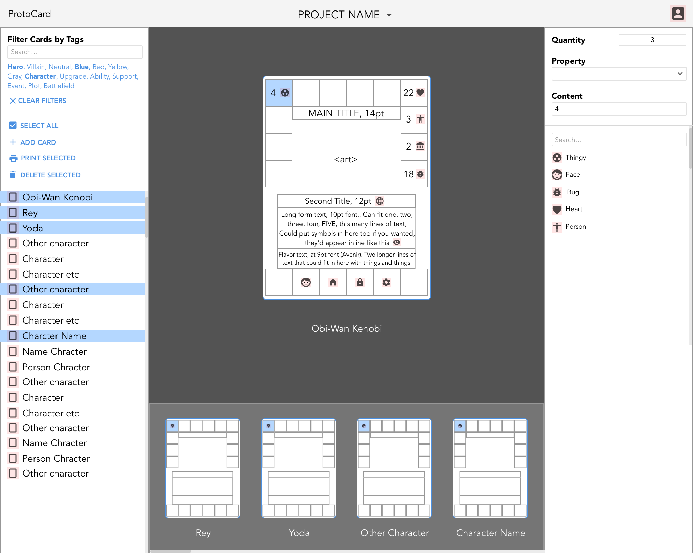

## ProtoCard
In-progress entry into She's Coding 2-month code-a-thon (Feb-Apr 2018)

A tool to quickly create, print, and iterate card game prototypes.

Primary Features:  
-User can upload a CSV file, map the columns to areas in a card layout, and quickly create prototype cards  
-User can edit the same field across multiple cards  
-User can print only cards selected (such as only those that have been edited)  

Main wireframe:

<kbd>
  
</kbd>
